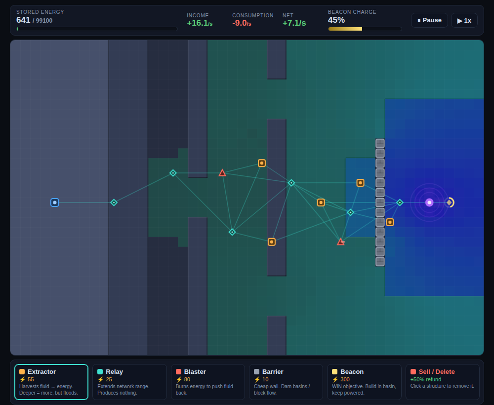

# Harvest the Hazard

A 2D top-down economy/strategy game. It's like *Creeper World*, **but the spreading fluid is your enemy *and* your only fuel.** You don't want to wipe it out — you want to manage a controlled flood: harvest rich, dangerous pools for energy while keeping the fluid off your base and network. Win by planting and charging a **Beacon** in the most lucrative, most lethal spot on the map.



## Run it

No build step, no dependencies, no server needed:

```
git clone <this-repo>
# then just open the file in any modern browser:
open index.html        # macOS
xdg-open index.html    # Linux
# or double-click index.html in your file manager
```

Everything (HTML, CSS, JS) is inline in a single `index.html`. It runs directly over `file://`.

## Controls (mouse only)

- **Build:** click a tool in the bottom toolbar, then click a valid grid cell to place it. Structures auto-connect if they're within link range of the Core or another connected structure. Green outline = valid placement, red = invalid.
- **Sell / remove:** **right-click** any structure (or pick the *Sell / Delete* tool and left-click it) for a 50% refund. The Core can't be sold.
- **Pause:** ⏸ button (top-right).
- **Fast-forward:** ▶ button cycles **1x → 2x → 3x**.

## How to play (the twist)

- **Extractors** turn fluid into energy. **Deeper fluid = more energy** — but past a threshold the fluid floods and **destroys** them (watch for the flashing `!`).
- **Relays** extend your network so you can reach distant ground. Everything must stay **connected** to the Core to work (dashed red outline = unpowered).
- **Blasters** burn energy to push the fluid back and protect your line.
- **Barriers** are cheap walls — **dam a basin** to grow a deeper, more lucrative reservoir, or wall off a corridor.
- **Beacon** is the objective: build it in the deadly basin and keep it powered. **Charge it to 100% to win.**
- You **lose** if the fluid submerges your **Core Base**. Keep it off the high ground.

A short "How to play" panel is shown on first load.

## Files

| File | Purpose |
|------|---------|
| `index.html` | The entire game (HTML + CSS + JS inline). |
| `DESIGN.md` | Full design spec + tuning notes, kept current. |
| `CHANGELOG.md` | One entry per version. |
| `snapshots/vX.Y.png` | A representative screenshot per version. |
| `.dev/shot.mjs` | Optional dev-only Playwright harness used for the visual self-test loop. Not needed to play. |

## Tuning

All gameplay numbers live in a single `CONFIG` object at the top of the `<script>` in `index.html`, so balancing is a one-stop edit. The terrain is a readable 24×16 ASCII map (`MAP24`) that is upscaled ×2 to the 48×32 play grid.
